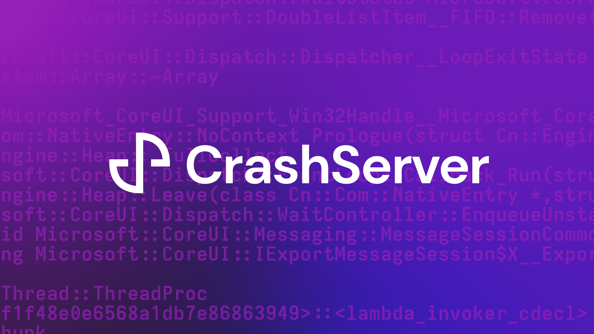

An implementation of an upstream collection server for the [Google Crashpad](https://chromium.googlesource.com/crashpad/crashpad/) crash handler. Intended to be as an all-in-one setup for small-to-medium projects who want to ability to:

- Store symbols and decode minidumps for separate projects
- View a list of recent crashes for any given project
- Allow for minidump upload from a public webpage

Built for open-source projects that use Google Crashpad, and want to host their own crash collection server.

## Getting Started

### Development

Running CrashServer locally can be done with the following commands:

```bash
$ git clone https://gitub.com/jameskr97/CrashServer.git
$ cd CrashServer/.docker/
$ docker-compose up -d
```

### Production

CrashServer is not yet ready for production environments. If you still choose to use CrashServer for your application, you may refer to the `.docker/docker-compose.yml` for necessary components. CrashServer is available as a container image at `ghcr.io/jameskr97/CrashServer`.

## TODO
- API
  - [x] `/api/minidump/upload` Upload Minidumps for project under endpoint.
    - [x] Handle `gzip` minidump upload
  - [x] `/api/synbol/upload` Upload Symbols for project under endpoint, secured by `api_key`
- Web
  - [x] List of all symbols for project
  - [x] Upload minidump (publicly)
  - [x] Upload symbols (authenticated users only)
- Backend
  - [x] Ensure minidump can be decoded before producing readable minidump
  - [ ] Support for symbols on development versions of the project
  - [ ] Auto-delete minidumps after a selected interval
  - [ ] Single project mode
  - [x] Implement `sym-upload-v1` protocol
  - [x] Implement `sym-upload-v2` protocol
  - [x] Use Amazon S3 (S3-Compatible) for all data store
- Misc
  - [ ] Documentation Generation
  - [ ] CI and Tests
  - [x] CLI Management interface (via flask)